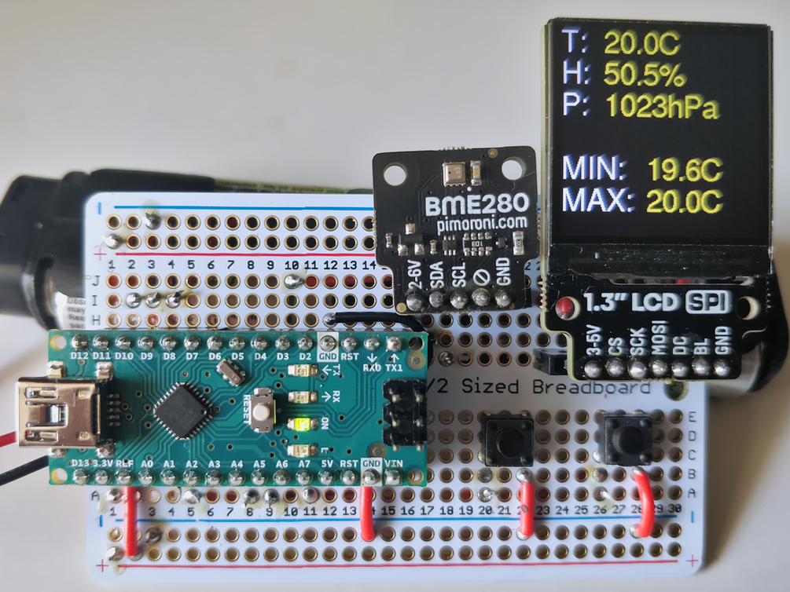

# 🌱 Semis 🌱

A greenhouse climate monitor using Arduino, BME280 and ST7789

- Temperature, humidity and pressure readings
- Display activated by a button to safe power
- Minimum and maximum temperature with reset button



## Components

- Arduino AVR based board, _e.g._ Uno/Nano/Leonardo/Micro
- [Pimoroni BME280](https://shop.pimoroni.com/products/bme280-breakout)
- [Pimoroni 1.3" SPI Colour LCD
  (240x240)](https://shop.pimoroni.com/products/bme280-breakout) (ST7789)
- Two switch buttons

Equivalent BME280 and ST7789 breakout boards (or even building your own from
more basic components) may also work but I have not tested.

The essential features are,

- I2C interface to the BME280
- SPI interface to the ST7789
- PWM control of the ST7789 backlight

## Connections

The BME280 is controlled over I2C so the SDA and SCL pins of the breakout board
should be connected to SDA (A4) and SCL (A5) pins of the Arduino respectively.

The ST7789 is controlled over SPI so the SCK and MOSI pins of the breakout must
be connected to the Arduino SCK and MOSI pins (13 and 11 respectively). The CS
and DC pins can be connected to any digital pins, 10 and 9 by default. The BL
pin should be connected to a PWM pin (to allow dimming of the display), 3 by
default. If your breakout has a RST pin this is not used.

The display and min/max reset buttons are connected as pull-up inputs. The
default pins are 7 and 8 respectively.

In summary the default pins are,

- BME280
  - SDA - SDA (A4)
  - SCL - SCL (A5)
- ST7789
  - CS - 10
  - SCK - SCK (13)
  - MOSI - MOSI (11)
  - DC - 9
  - BL - 3
- display button - 7
- min/max reset button - 8

## Building and installation

Using [`arduino-cli`](https://arduino.github.io/arduino-cli/latest/), ensure
that the AVR core is installed

```
$ arduino-cli core install arduino:avr
```

Install the dependencies

```
$ arduino-cli lib install "Adafruit ST7735 and ST7789 Library" BME280
```

Configure [`semis/semis.ino`](semis/semis.ino) with your text editor. In
particular you might want to adjust

- `TFT_ROTATATION` - Rotates the image on the TFT to suit its orientation
- `TFT_ON` - Brightness of TFT when on, this is an `int` in the range `0-255`
- `DISPLAY_PIN` and `RESET_PIN` - The digital pins which the display on and
  min/max reset switches are connected to respectively

Get the port path and fqbn of your board, for example

```
$ arduino-cli board list
Port         Type              Board Name  FQBN            Core
/dev/ttyACM0 Serial Port (USB) Arduino Uno arduino:avr:uno arduino:avr
```

Build the program

```
$ arduino-cli complie -b <fqbn> semis
```

where `<fqbn>` is the fully qualified board name for your Arduino board that
you got in the previous step.

Upload the program to your Arduino

```
$ arduino-cli upload -b <fqbn> -p <port> semis
```

where `<fqbn>` and `<port>` are the fully qualified board name and port path of
your Arduino board.
